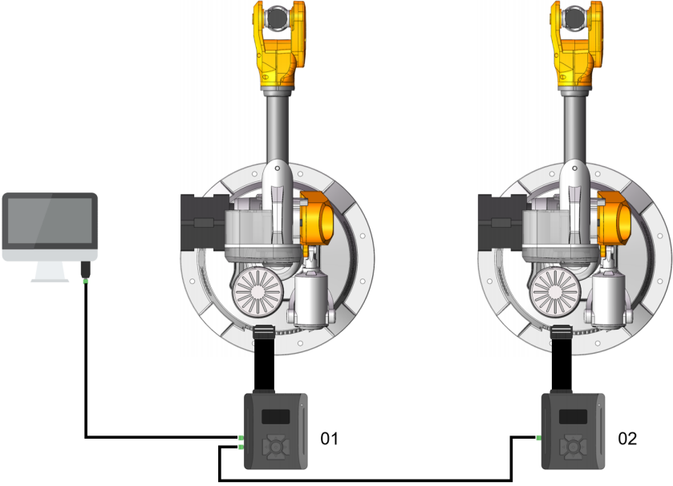
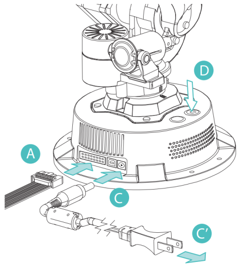
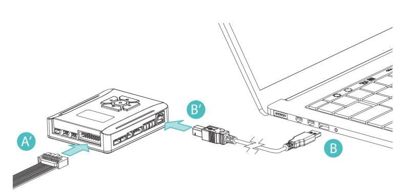
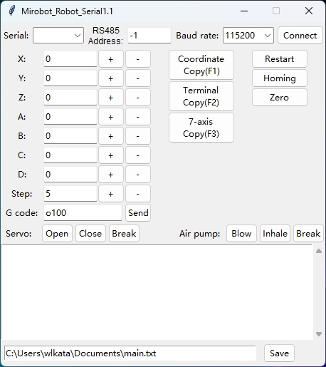
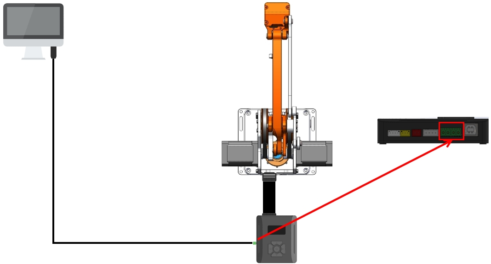
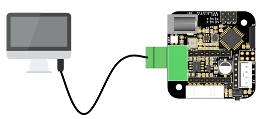

# wlkatapython

#### Python version 3.9.0

#### wlkatapython version 0.1.0

#### License: MIT

## IMPORTANT!!!

**&nbsp;&nbsp;&nbsp;&nbsp;This is a package that uses Python to control products such as Mirobot robotic arms, E4 robotic arms, slides, conveyor belts, etc. This package mainly communicates through pyserial and G code protocols. Currently, it supports RS485 or UART communication. It should be noted that when using this package, a multi-functional controller is required, as some functions of the modified package use multi-functional controllers. If the mechanical arm is directly connected, some functions may not be effective.**
  

## Description

**&nbsp;&nbsp;&nbsp;&nbsp;Wlkatapython is a Python package used to control products such as Mirobot robotic arms, E4 robotic arms, slides, conveyor belts, etc.**

**&nbsp;&nbsp;&nbsp;&nbsp;This component uses the G code protocol to communicate with the Mirobot over a serial connection. The official**

**&nbsp;&nbsp;&nbsp;&nbsp;G code instruction set** and **driver download** can be found at the [WLkata Download Page](https://www.wlkata.com/pages/download-center)

## Mirobot Wiring diagram(RS485)

<div style="text-align: center;">
  
</div>

## Mirobot Example Usage(RS485)

```python
import wlkatapython
import serial
import time

"Robot arm returns to zero"
Serial1=serial.Serial ("COM3", 38400) # Set serial port and baud rate
Mirobot1=wlkatapython.Mirobot_UART() # Create a new mirobot1 object
Mirobot1.init (serial1, 1) # Set the address of the robotic arm
Mirobot1.homing() # Robot arm zeroing
Serial1.close() # Close serial port
```

```python
import wlkatapython
import serial

"Execute offline files"
Serial1=serial.Serial ("COM3", 38400) # Set serial port and baud rate
Mirobot1=wlkatapython.Mirobot_UART() # Create a new mirobot1 object
Mirobot1.init (serial1, 1) # Set the address of the robotic arm
Mirobot1.runFile ("ceshi", False) # Execute a file in a loop. True is the loop execution file, and False is the single execution file
Serial1.close() # Close serial port
```

```python
import wlkatapython
import serial
import time

"Stop the current program"
Serial1=serial.Serial ("COM3", 38400) # Set serial port and baud rate
Mirobot1=wlkatapython.Mirobot_UART() # Create a new mirobot1 object
Mirobot1.init (serial1, 1) # Set the address of the robotic arm
Mirobot1.runFile ("ceshi", True) # Loop execution of a file, True is the loop execution file, False is the single execution file
time.sleep (5) # Wait for 5 seconds
Mirobot1.cancelation() # Stop the currently running program
Serial1.close() # Close serial port
```

## Mirobot Wiring diagram(UART)

<div style="text-align: center;">
  
  
</div>

## Mirobot Example Usage(UART)

```python
import wlkatapython
import serial
import time

"Robot arm returns to zero"
Serial1=serial.Serial ("COM3", 115200) # Set serial port and baud rate
Mirobot1=wlkatapython.Mirobot_UART() # Create a new mirobot1 object
Mirobot1.init (serial1, -1) # Set the address of the robotic arm
Mirobot1.homing() # Robot arm zeroing
Serial1.close() # Close serial port
```

```python
import wlkatapython
import serial

"Execute offline files"
Serial1=serial.Serial ("COM3", 115200) # Set serial port and baud rate
Mirobot1=wlkatapython.Mirobot_UART() # Create a new mirobot1 object
Mirobot1.init (serial1, -1) # Set the address of the robotic arm
Mirobot1.runFile ("ceshi", False) # Execute a file in a loop. True is the loop execution file, and False is the single execution file
Serial1.close() # Close serial port
```

```python
import wlkatapython
import serial
import time

"Stop the current program"
Serial1=serial.Serial ("COM3", 115200) # Set serial port and baud rate
Mirobot1=wlkatapython.Mirobot_UART() # Create a new mirobot1 object
Mirobot1.init (serial1, -1) # Set the address of the robotic arm
Mirobot1.runFile ("ceshi", True) # Loop execution of a file, True is the loop execution file, False is the single execution file
time.sleep (5) # Wait for 5 seconds
Mirobot1.cancelation() # Stop the currently running program
Serial1.close() # Close serial port
```

## Simple upper computer

<div style="text-align: center;">
  
</div>


**&nbsp;&nbsp;&nbsp;&nbsp;Mainly used for debugging the Cartesian positioning of robotic arms on devices that are inconvenient to install and use with Wlkatastudio.**  


```python
import wlkatapython
"""
Mirobot_Serial_GUI
"""
Mirobot_GUI=wlkatapython.Mirobot_Serial_GUI()
Mirobot_GUI.Mirobot_GUI()
```

## Mirobot Wiring diagram(RS485)

<div style="text-align: center;">
  
</div>

## Mirobot Example Usage(RS485)

```python
import wlkatapython
import serial

"Robot arm returns to zero"
Serial1=serial.Serial ("COM3", 38400) # Set serial port and baud rate
MT4_1=wlkatapython.MT4_UART() # Create a new MT4_1 object
MT4_1.init (serial1, 1) # Set the address of the robotic arm
MT4_1.homeing() # Robot arm zeroing
Serial1.close() # Close serial port
```

```python
import wlkatapython
import serial

"Execute offline files"
Serial1=serial.Serial ("COM3", 38400) # Set serial port and baud rate
MT4_1=wlkatapython.MT4_UART() # Create a new MT4_1 object
MT4_1.init (serial1, 1) # Set the address of the robotic arm
MT4_1.runFile ("ceshi", False) # Execute a file in a loop. True is the loop execution file, and False is the single execution file
Serial1.close() # Close serial port
```

```python
import wlkatapython
import serial
import time

"Stop the current program"
Serial1=serial.Serial ("COM3", 38400) # Set serial port and baud rate
MT4_1=wlkatapython.MT4_UART() # Create a new MT4_1 object
MT4_1.init (serial1, 1) # Set the address of the robotic arm
MT4_1.runFile ("ceshi", True) # Loop execution of a file, True is the loop execution file, False is the single execution file
time.sleep (5) # Wait for 5 seconds
MT4_1.cancelation() # Stop the currently running program
Serial1.close() # Close serial port
```

## MT4 Wiring diagram(UART)

<div style="text-align: center;">
  
</div>

## MT4 Example Usage(UART)

```python
import wlkatapython
import serial

"Robot arm returns to zero"
Serial1=serial.Serial ("COM3", 115200) # Set serial port and baud rate
MT4_1=wlkatapython.MT4_UART() # Create a new MT4_1 object
MT4_1.init (serial1, -1) # Set the address of the robotic arm
MT4_1.homing() # Robot arm zeroing
Serial1.close() # Close serial port
```

```python
import wlkatapython
import serial

"Execute offline files"
Serial1=serial.Serial ("COM3", 115200) # Set serial port and baud rate
MT4_1=wlkatapython.MT4_UART() # Create a new MT4_1 object
MT4_1.init (serial1, -1) # Set the address of the robotic arm
MT4_1.runFile ("ceshi", False) # Execute a file in a loop. True is the loop execution file, and False is the single execution file
Serial1.close() # Close serial port
```

```python
import wlkatapython
import serial
import time

"Stop the current program"
Serial1=serial.Serial ("COM3", 115200) # Set serial port and baud rate
MT4_1=wlkatapython.MT4_UART() # Create a new MT4_1 object
MT4_1.init (serial1, -1) # Set the address of the robotic arm
MT4_1.runFile ("ceshi", True) # Loop execution of a file, True is the loop execution file, False is the single execution file
time.sleep (5) # Wait for 5 seconds
MT4_1.cancelation() # Stop the currently running program
Serial1.close() # Close serial port
```

## MS4220 Wiring diagram(RS485)

<div style="text-align: center;">
  
</div>

## MS4220 Example Usage(RS485)

```python
import wlkatapython
import serial
import time

Serial1=serial.Serial ("COM3", 38400) 
MS4220_1=wlkatapython.MS4220_UART()
MS4220_1.init(Serial1,10)
MS4220_1.speed(100)
time.sleep(5)
MS4220_1.speed(-100)
time.sleep(5)
MS4220_1.speed(0)
```

## Communication Methods

**&nbsp;&nbsp;&nbsp;&nbsp;Please contact wlkata personnel for further instructions.[WLkata Download Page](https://www.wlkata.com/pages/download-center)** 
